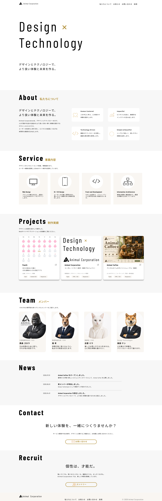

# Animal Corporation

架空のデザイン・テクノロジー企業「Animal Corporation」をテーマに制作した、コーポレートサイトのデモプロジェクトです。

情報設計からUIデザイン、フロントエンド実装、公開までを一貫して行い、ユーザーにとって分かりやすい情報構造と、シンプルで美しいデザインを意識して制作しました。

## Live Demo

🌐 [Webサイトを見る](https://animal.hamltail.dev/)

## Mockup



## Design

🎨 [Figmaデザインを見る](https://www.figma.com/design/aiLzbeBUsuAQrv9Da9ldEb/ポートフォリオ?node-id=2003-267&t=vLoYEO8nfKudoHhh-1)

## Tech Stack

| Category       | Technologies                             |
| -------------- | ---------------------------------------- |
| Design         | Figma                                    |
| Frontend       | Next.js, React, TypeScript, Tailwind CSS |
| Testing        | Playwright                               |
| Infrastructure | Docker, Vercel, GitHub Actions           |

## Technical Decisions

当初は HTML・JavaScript・Vite を用いた静的サイトとして制作していましたが、Next.js へ移行しました。

セクションごとにコンポーネントを分離することで、保守性と再利用性を意識した設計にしています。

## Docker

### Build

```bash
docker build -t corporate-site-demo .
```

### Start

```bash
docker run --rm --name corporate-site-demo -p 3000:3000 corporate-site-demo
```

### Check

```bash
docker ps
```

### Stop

```bash
docker stop corporate-site-demo
```

`--rm` を指定しているため、停止したコンテナは自動的に削除されます。

## License

このリポジトリはポートフォリオ目的で公開しています。

著作権は作者に帰属します。
無断転載・再配布・商用利用はご遠慮ください。

This repository is published for portfolio purposes only.

All rights to the content belong to the author.

Please do not reproduce, redistribute, or use any part of this project for commercial purposes without permission.

## Author

- h-waji (hamltail)
