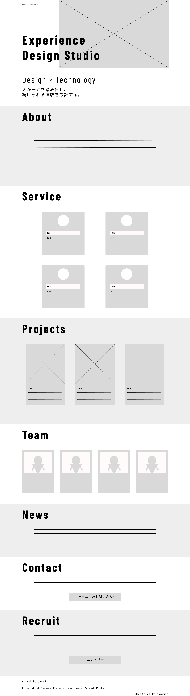

# Animal Corporation

架空のデザイン・テクノロジー企業「Animal Corporation」をテーマに制作した、コーポレートサイトのデモプロジェクトです。

本プロジェクトでは、情報設計からワイヤーフレーム作成、FigmaによるUIデザイン、フロントエンド実装までを一貫して行いました。

ユーザーにとって分かりやすい情報構造と、シンプルで美しいデザインを意識し、企画からデザイン、実装、公開までの制作工程をポートフォリオとしてまとめています。

## Demo

🌐 [デモサイトを見る](https://animal.hamltail.dev/)

## Wireframe

2026-06-17 作成

## Mockup

2026-06-19 作成（2026-06-22 更新）

## Figma

🎨 [Figmaデザインを見る](https://www.figma.com/design/aiLzbeBUsuAQrv9Da9ldEb/ポートフォリオ?node-id=2003-267&t=vLoYEO8nfKudoHhh-1)

## Tech Stack

- Figma
- HTML
- JavaScript
- Tailwind CSS
- Vite

## Technical Decisions

本プロジェクトでは、コーポレートサイトの静的実装に焦点を当てています。

比較的シンプルな構成のため、HTML・JavaScriptをベースに実装し、情報設計・UIデザイン・フロントエンド実装の工程を重視しました。

そのため、本作品では React や Next.js、CMS は採用していません。

## License

このリポジトリはポートフォリオ目的で公開しています。

著作権は作者に帰属します。
無断転載・再配布・商用利用はご遠慮ください。

This repository is published for portfolio purposes only.

All rights to the content belong to the author.

Please do not reproduce, redistribute, or use any part of this project for commercial purposes without permission.

## Author

- h-waji (hamltail)
